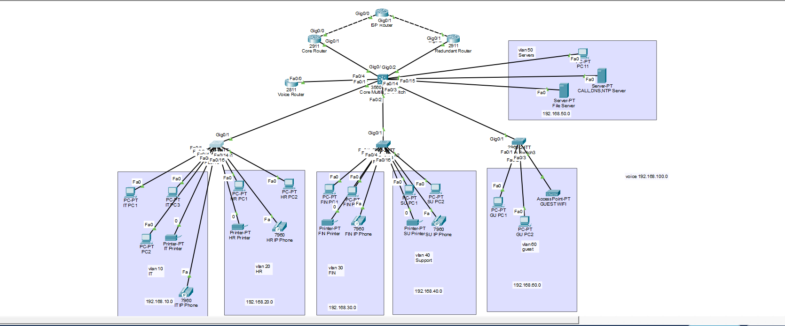

## Network Topology

# Enterprise Campus Network Security Architecture (Cisco)

# Overview

This project simulates the design and security hardening of a multi-VLAN enterprise campus network using Cisco switching technologies in Packet Tracer.

The goal was not just to make devices communicate, but to implement structured segmentation, enforce access control policies, and secure the access layer against common Layer 2 threats — while keeping the entire network fully functional.

This lab reflects how a small-to-mid-size enterprise campus network would be structured and protected.

# Network Architecture

Core Layer

Cisco 3560 Layer 3 Switch

Inter-VLAN routing implemented using SVIs

Access Layer

Multiple Cisco 2960 switches

Access ports for endpoints

Trunk links to core switch

# VLAN Structure

VLAN 10 – IT

VLAN 20 – HR

VLAN 30 – Sales

VLAN 40 – Management

VLAN 50 – Servers

VLAN 60 – Guest

VLAN 100 – Voice

Each VLAN has its own subnet and gateway configured on the Layer 3 switch.

# Endpoint & Service Deployment

Deployed departmental PCs within their respective VLANs

Configured network printers inside departmental VLANs

Implemented Voice VLAN (VLAN 100) for IP phones

Ensured separation of voice and data traffic

Verified DHCP functionality for both data and voice networks

Tested inter-VLAN routing while enforcing segmentation policies

This setup simulates a realistic enterprise user environment.

# Key Implementations

# Inter-VLAN Routing

Configured SVIs on the 3560 core switch

Verified end-to-end connectivity across VLANs

# Network Segmentation (ACL Enforcement)

Implemented extended ACL to isolate Guest VLAN from internal networks

Created Server protection policy allowing access only from IT VLAN

Applied ACLs with correct direction logic (inbound/outbound placement)

Validated policy enforcement using traffic testing and ACL hit counters

# Access Layer Hardening

Enabled PortFast on access ports

Configured BPDU Guard to prevent rogue switch attacks

Administratively shut down unused ports

Restricted trunk links to allow only necessary VLANs

# DHCP Security

Implemented DHCP Snooping on all access switches

Trusted only trunk uplink ports

Disabled Option 82 (Packet Tracer limitation)

Verified proper IP allocation after implementation

# Port Security

Enabled sticky MAC address learning

Limited MAC addresses per access port

Adjusted MAC limits for VoIP ports to handle multi-MAC behavior

Tested and recovered from violation scenarios

# Security Controls Implemented

VLAN Segmentation

Extended ACL Policy Control

Guest Network Isolation

Server VLAN Protection

DHCP Snooping

Port Security

BPDU Guard

Trunk VLAN Restriction

# Validation & Troubleshooting

Throughout the project, I performed live traffic testing to validate:

Guest isolation from internal VLANs

Server access restrictions

DHCP functionality after security changes

ACL hit counter verification

Port security violation handling

Trunk behavior after VLAN restriction

Issues such as DHCP Option 82 behavior and port security shutdown events were identified and resolved during implementation.

# Skills Demonstrated

Layer 2 & Layer 3 Switching

Enterprise VLAN Architecture

ACL Design & Traffic Flow Analysis

Access Layer Security Hardening

DHCP Attack Mitigation

Network Policy Enforcement

Structured Troubleshooting & Validation

This project represents a secure and structured campus network design that goes beyond basic connectivity and focuses on segmentation, policy enforcement, and access-layer protection.
